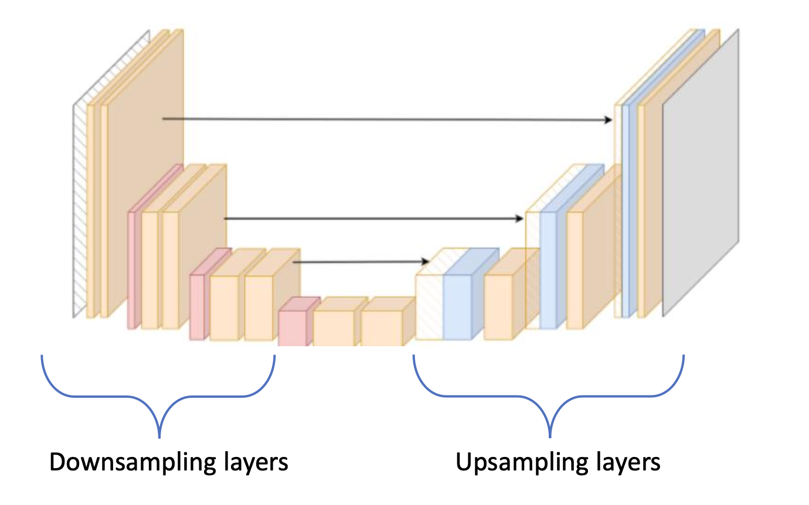
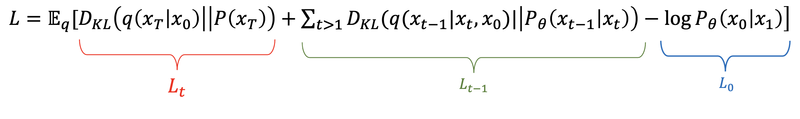
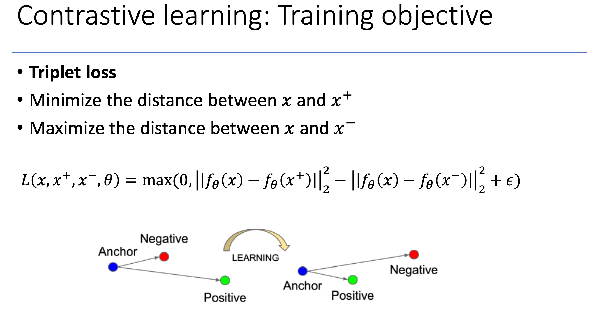

# Questions and Answers
## 1. VAE vs. Diffusion Models

### Similarities:
1. Both diffusion models and VAEs utilize variational inference as a foundation for their training. In VAEs, the objective is to minimize the negative Evidence Lower Bound (ELBO), which includes a KL-divergence term to align the approximate posterior with the prior distribution. While diffusion models are also based on probabilistic principles and their loss functions are derived from variational bounds, they typically optimize a simplified objective, often equivalent to minimizing the mean squared error between predicted and actual noise at each timestep of the reverse diffusion process. Both approaches share a probabilistic foundation for learning a distribution over the data.

2. Both VAEs and diffusion models involve sampling from Gaussian distributions:
- **VAEs**: The latent variable \( z \) is sampled from a Gaussian distribution.
- **Diffusion Models**: Gaussian noise is added to the data during the forward process, and the reverse process iteratively samples from conditional Gaussian distributions to denoise the data.

This shared reliance on Gaussian distributions highlights the probabilistic nature of both models and their use of Gaussian assumptions to model uncertainty and noise.

3. We can say both of the models are Generative Models.

### Differences:

1. VAEs rely on probabilistic latent variable models and use an encoder-decoder architecture to map data into a latent space, where the latent variables follow a predefined distribution (commonly Gaussian). Diffusion models, on the other hand, progressively add noise (like Gaussian noise) to the data over a series of steps during the forward process, effectively transforming the data into pure noise. The reverse process involves step-by-step denoising to recover the original data.

2. The architectures of VAEs and diffusion models differ. VAEs are based on autoencoders, consisting of an encoder and a decoder that samples from a latent space. Diffusion models commonly employ U-Net architectures, which are well-suited for processing data at multiple scales, although other architectures can also be used.

3. The inherent design of VAEs, with its information bottleneck and smoothing effect, leads to blurry and less realistic results. Diffusion models, by learning to reverse a noise process, can generate much higher-quality and more realistic images. This difference in image quality is a significant factor in the increasing popularity of diffusion models for generative tasks.

## 2. Dequantization
Dequantization is a technique used to transform discrete data into a continuous space by adding random noise. For example, pixel values in images are often discrete integers (e.g., 0–255). Dequantization adds small noise to these values, creating a continuous range in order to preserve singularities of discrete data in flow models. This process allows models to work with a continuous probability density function, which is crucial for effective training in generative models like VAEs or flow-based models.

## 3. The significance of Coupling Network in Coupling Flow

Coupling flows address the computational challenge of calculating the determinant of the Jacobian matrix by splitting data into two parts: one part remains unchanged (or serves as a condition), while the other part is transformed using an invertible function parameterized by a coupling network. This design simplifies the Jacobian to a triangular form, making the determinant calculation efficient. The coupling transform modifies the selected part of the data in a structured, invertible manner (e.g., through affine transformations) without explicitly adding noise. These transformations are stacked iteratively, allowing the model to map simple distributions (like Gaussians) to complex data distributions while ensuring efficient training and sampling.

## 4. Intermediate steps in reverse diffusion.

As you can see, the loss function of diffusion models and \( L_{t-1} \) is: "How closely you can reconstruct the intermediate denoising steps." When we don't have these steps, the quality of the reconstructed images can decrease significantly, and in some cases, they may not even be reconstructed.

## 5. Self-Supervised Learning
The idea behind self-supervised learning is to extract labels and annotations from the model itself, which significantly reduces costs. In supervised learning, labeling large amounts of data is very expensive. In self-supervised learning, we have a pretraining task where the model learns the features and annotations of the data on its own. Then, we have a fine-tuning phase, which teaches the model about a specific task. An example of this is with large language models (LLMs). For instance, "GPT" is the pretrained model that does nothing more than predicting the next word. After fine-tuning, we get "ChatGPT," which is fine-tuned on task-related data and is now ready to work as an assistant.

## 6. Contrastive Learning

In contrastive learning, \(x\) is our anchor, \(x^+\) is the object whose distance to the anchor we want to minimize, and \(x^-\) is the object that is unrelated, for which we want to maximize the distance from the anchor in the vector space. This method of loss, called **triplet loss**, leverages the idea of vectorizing images and texts into a meaningful vector space where related items are close to each other, and unrelated items are farther apart. This alignment ensures that similar objects are grouped together, while dissimilar ones are separated in the vector space.